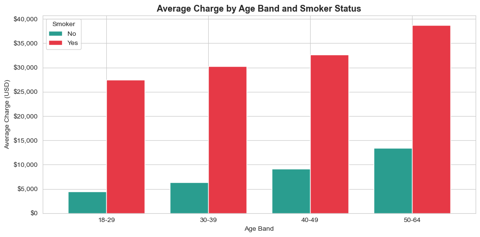
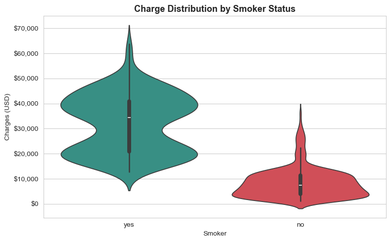
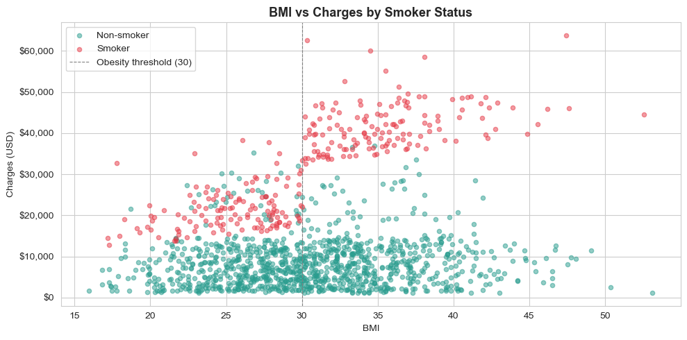
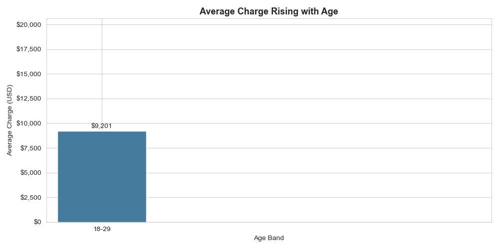

# 🏥 Insurance Charges - Actuarial Analysis & Premium Pricing

### Risk Segmentation · Loss Analysis · Premium Pricing Model

[](https://python.org)
[](https://scikit-learn.org)
[](https://sqlite.org)
[]()
[]()

---

## Description

An end-to-end actuarial analysis of a health insurance portfolio (1,338 policyholders). The project identifies the key risk factors driving insurance charges — smoking, age, BMI, and region — quantifies them into risk loadings, and builds a linear regression model for premium pricing. The workflow combines object-oriented Python, SQL analysis, automated visualizations, an Excel report, and a Power BI dashboard. Key finding: smokers cost 3.8x more than non-smokers, and obese smokers represent the highest-risk segment at over 3x the portfolio average.

---

## Project Structure

```
Insurance_Claims_Analysis/
│
├── data/
│   ├── insurance.csv               # raw dataset (1,338 policyholders)
│   └── insurance_clean.csv         # cleaned + engineered features (notebook output)
│
├── notebooks/
│   └── 01_data_cleaning.ipynb      # data cleaning, feature engineering, EDA
│
├── src/
│   ├── models.py                   # OOP: Policyholder, Policy, InsurancePortfolio
│   ├── analysis.py                 # actuarial metrics: risk loading, averages
│   ├── sql_analysis.py             # 2 SQL queries via in-memory SQLite
│   ├── visualization.py            # 3 charts + 1 animated GIF
│   ├── insights.py                 # business insights + premium pricing model
│   └── excel_report.py             # styled Excel summary report
│
├── output/                         # charts, GIF, Excel, CSVs for Power BI
├── main.py                         # entry point — runs the full pipeline
├── requirements.txt
└── README.md
```

---

## Quick Setup

```bash
git clone https://github.com/gibiai/Insurance_Claims_Analysis.git
cd Insurance_Claims_Analysis
pip install -r requirements.txt
```

Run the full pipeline:
```bash
python3 main.py
```

Or run the cleaning notebook first, then individual modules:
```bash
jupyter notebook notebooks/01_data_cleaning.ipynb
python3 src/analysis.py
python3 src/sql_analysis.py
python3 src/visualization.py
python3 src/insights.py
python3 src/excel_report.py
```

---

## Dependencies

```
pandas>=2.0
numpy>=1.24
matplotlib>=3.7
seaborn>=0.12
scikit-learn>=1.3
openpyxl>=3.1
pillow>=10.0
jupyter>=1.0
```

---

## Methodology

### Object-Oriented Design (`models.py`)
The portfolio is modeled with three classes: `Policyholder` (risk attributes with computed properties like `bmi_category` and `risk_flags`), `Policy` (links a holder to their annual charge), and `InsurancePortfolio` (manages the collection and computes aggregate metrics, with a `from_dataframe` classmethod constructor).

### Actuarial Analysis (`analysis.py`)
Computes portfolio metrics and a **risk loading table** — by how much each segment's average charge exceeds the portfolio average. A loading above 1.0 indicates a segment that warrants a higher premium.

### SQL Analysis (`sql_analysis.py`)
Two queries on an in-memory SQLite database: average charge by smoker status and region, and age bands costing above the portfolio average (using `CASE`, `HAVING`, and a scalar subquery).

### Premium Pricing Model (`insights.py`)
A Linear Regression predicts charges from risk factors. Linear Regression is chosen for interpretability — each coefficient shows a factor's dollar impact on the premium, which is essential for actuarial transparency.

---

## Output

### Charts

**Average Charge by Age Band and Smoker Status**


**Charge Distribution by Smoker Status**


**BMI vs Charges by Smoker Status**


**Average Charge Rising with Age (animated)**


---

## Key Findings

| Finding | Value |
|---------|-------|
| **Smoker multiplier** | 3.8x - smokers cost $32,050 vs $8,441 |
| **Highest-risk segment** | Obese smokers - $41,558 avg (3.1x portfolio avg) |
| **Age effect** | +95% from youngest to oldest band |
| **Most expensive region** | Southeast ($14,735 avg) |
| **Pricing model R²** | 0.807 — explains 81% of charge variance |
| **Model MAE** | $4,182 average prediction error |

---

## Business Recommendations

1. **Apply a substantial smoker loading** — smoking is by far the dominant cost driver and justifies the largest premium adjustment.
2. **Add a BMI-based surcharge for obese policyholders** — particularly when combined with smoking, where charges exceed 3x the average.
3. **Implement age-tiered pricing** — charges rise steadily and predictably with age.
4. **Consider mild regional adjustments** — the Southeast shows consistently higher charges.

---

## Techniques Used

| Area | Techniques |
|------|-----------|
| **Python / OOP** | dataclasses, properties, classmethods, type hints |
| **SQL** | SQLite in-memory, GROUP BY, CASE, HAVING, subqueries |
| **Machine Learning** | Linear Regression, Label Encoding, train/test split, R²/MAE |
| **Visualization** | Matplotlib, Seaborn, FuncAnimation, violin plots |
| **Reporting** | openpyxl styled Excel, Power BI dashboard |

---

## 📊 Power BI Dashboard

Power BI dashboard focused on health insurance portfolio data, analyzing the impact of demographic factors, BMI, and smoker status on medical charges.


📊 *[Power BI](https://app.powerbi.com/view?r=eyJrIjoiN2MyNGE3YjQtODM1NS00YTJlLTg0NzMtMWZmOWE2ZmUxOGNmIiwidCI6IjFmNTRhMThlLTg0MjUtNDdiYi1hMDk3LTczODg2ZTM1MTE4YSIsImMiOjh9)*
↗️ *Ctrl+click to open in a new tab*

---

## Author

**Gabriele De Carlo** — Data Analyst Portfolio Project, 2025
Dataset: [Medical Cost Personal Dataset](https://raw.githubusercontent.com/stedy/Machine-Learning-with-R-datasets/master/insurance.csv)
